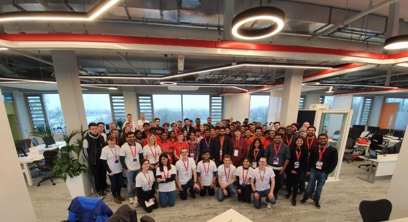

# [Jamiu Salimon](https://www.linkedin.com/in/dkmdebugin/)
Software Development | Cloud/DevOps | Machine Learning

<h2> Hello there </h2>

My #dev summary goes as follows;

* Fresh first class graduate from a master's degree in software engineering
* Winner of the JnJ 2020 #CodeItUp hackathon
* Programming languages: Java, Python, JavaScript, Bash, Golang
* Other technologies: Linux, AWS, GCP, MySQL
* Open source communities: PySlackers, MDN Web Docs
* Open source contributions: Flask
* I’m currently  working on getting Linux+, Docker, and Kubernetes certified
* I'm looking to collaborate on open source projects
* Ask me about anything, I'll be happy to help.
* 😄 Pronouns: He/him
* 📫 Feel free to connect on [LinkedIn](https://www.linkedin.com/in/dkmdebugin/).
